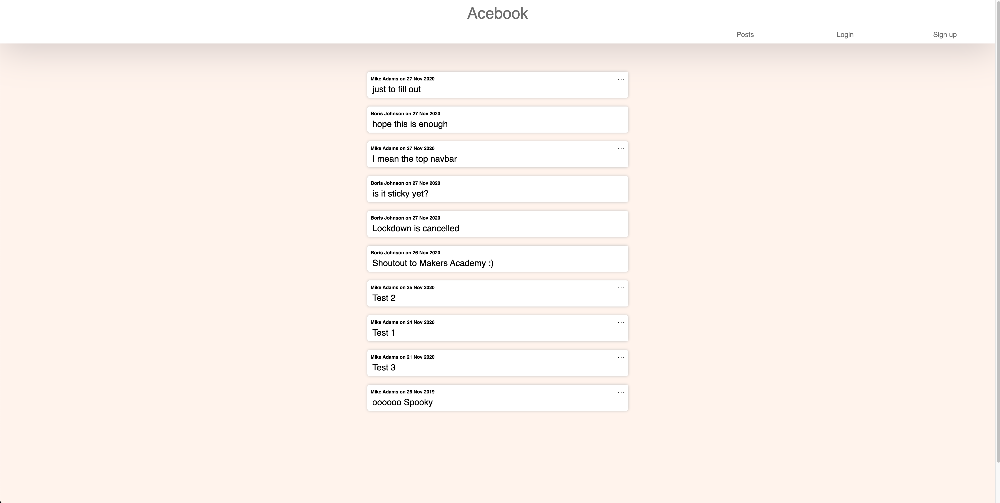

# Acebook
### By Quixotic

_A Facebook clone front-end._

# Installing and Running

1. Clone this repo to your local drive
2. run `npm install` to get all dependencies
3. run `npm start` to load app on [localhost:3000](http://localhost:3000/)

# Set up React calling API

## Setting up react app
1. Created react app using create-react-app (library).  
   Command was npx create-react-app acebook-frontend
2. Move to that directory
3. Run npm start to boot server
4. Open browser then react welcome message appears

## Creating a table
1. Created folder under src called ‘components’
2. Created a table file in that folder called Table.js
3. Within Table.js we required react
4. We created a constant called Table which runs a function (?) that returns html for a table
5. Within that table are the headers and the rows are pulled through using the API keys
6. Put a loading message when data not yet loaded (line 28)
7. Line 34 exports table somewhere

## Fetching the API data in App.js
1. Require react and table.js
2. Created a class which extends component ?
3. Set instance variable with ‘users’ array line 8
4. We fetched the data from a dummy api
5. Return the Table users using the instance variable for users.  

Then the data shows on localhost: 3000

Bootstrap can be used to improve the table formatting further

